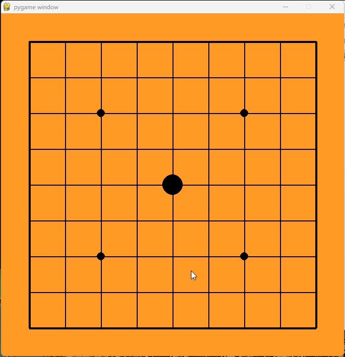

# five_in_row_exe

This is an implementation of a Gomoku (Five-in-a-Row) human-computer interactive interface based on AlphaGo technology, which can run directly on Windows machines equipped with CUDA-enabled discrete graphics cards.

Here is a demonstration:

Due to insufficient GitHub LFS storage space, the EXE file is temporarily stored at the following link:

[Link](https://pan.quark.cn/s/977f475f9fa4)
